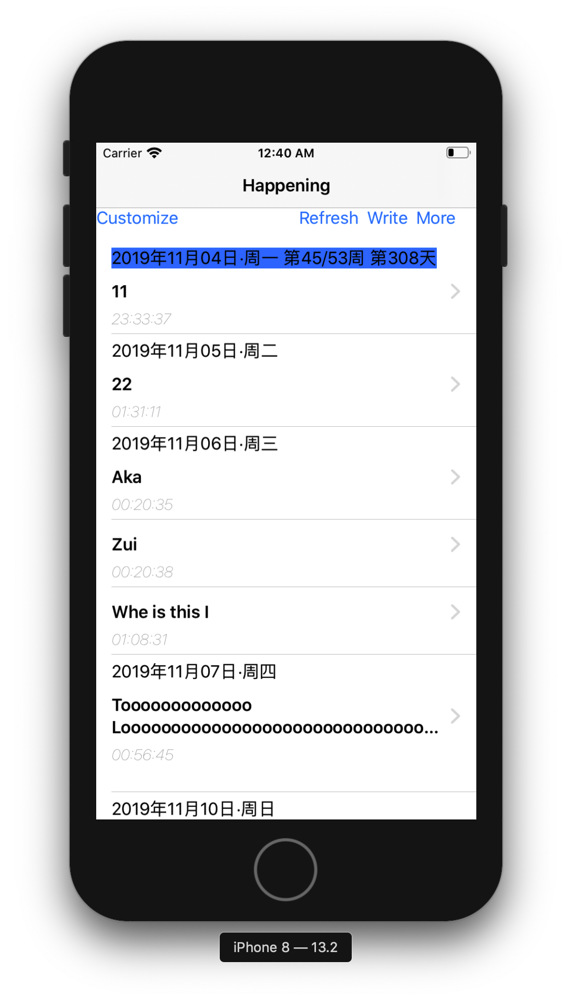
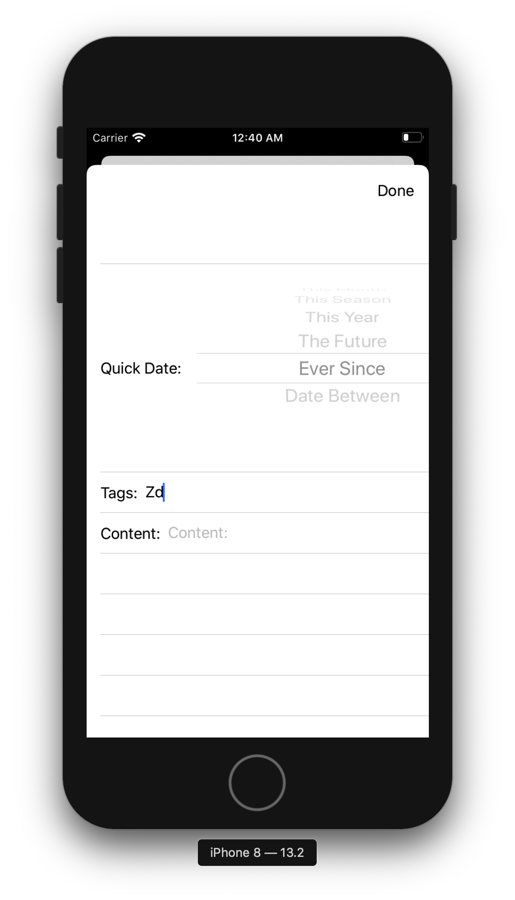
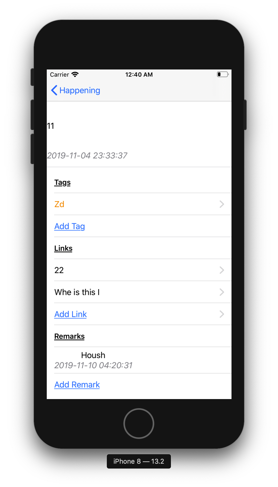
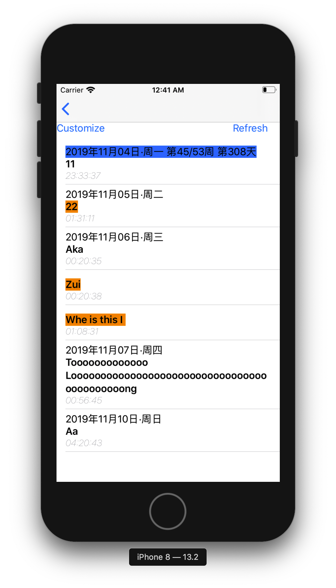
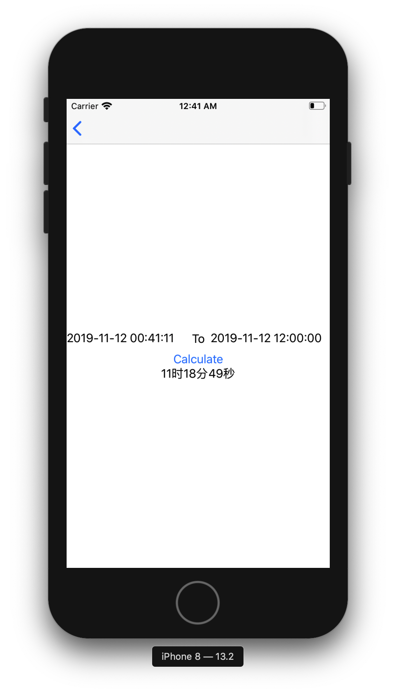
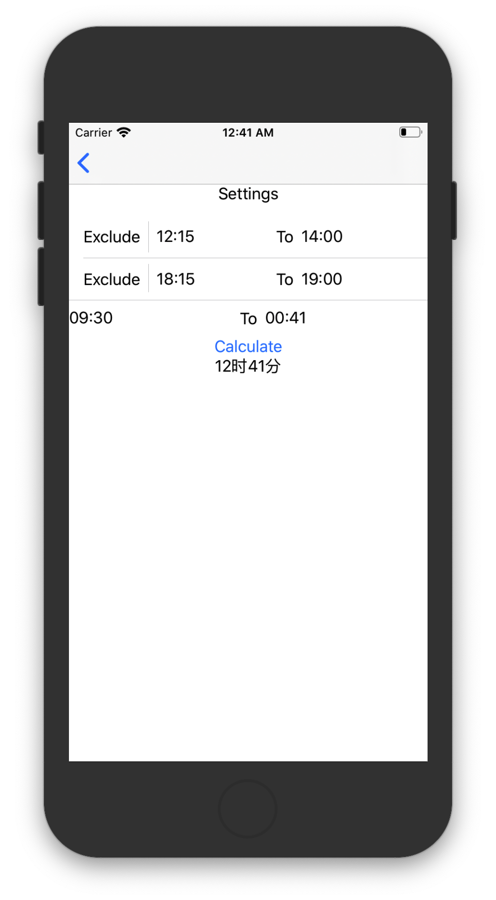

# 关于X
该应用是X在iOS上的复刻，回想起两年以前在大学，在翻遍应用市场找不到一个可以用作我们作为思想者和写作者在电子世界的延续后，我开发了Android版的X，当时它只运行于Android 6.0，所以去年升级系统之后就再也没有打开过它（这是个愚蠢的决定，我当时应当尝试导出里面的数据）。如今一年有余，X on Android, 早已逝去；但，X for Life, 已经到来。

# 快速界面预览
这是X on iOS，它适配了小屏幕的iPhone 8, 理论上在大屏幕的iPhone应该没有什么差别，但是我没有验证过，这些细枝末节的问题留给有需要的人去发现吧。

### 主界面

### 查询条件设置界面

### note详细界面

### 选择link界面

### 工具1：计算时间差

### 工具2：计算加班时间

# 如何使用
用XCode (>=12.2)打开X.xcodeproj,然后运行即可。 

关于你想如何使用它，是你的自由。